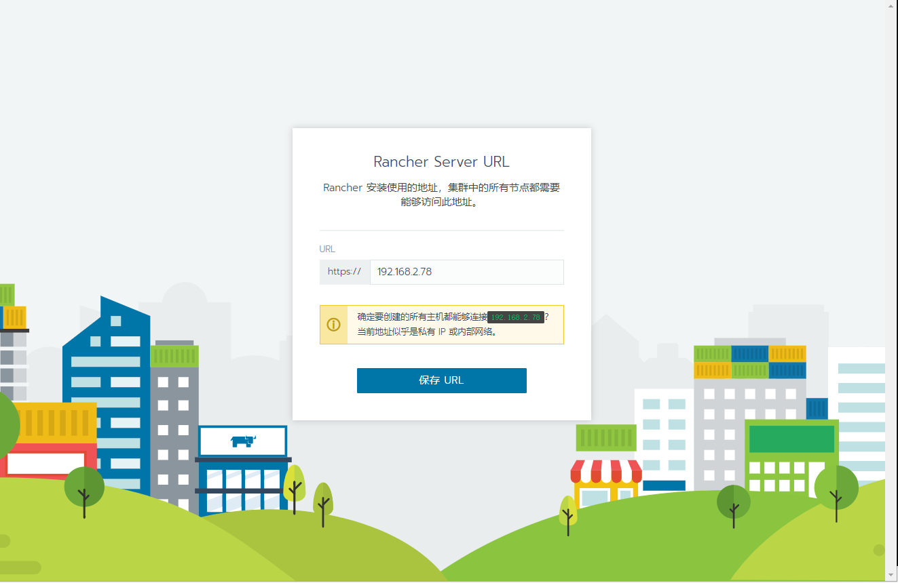
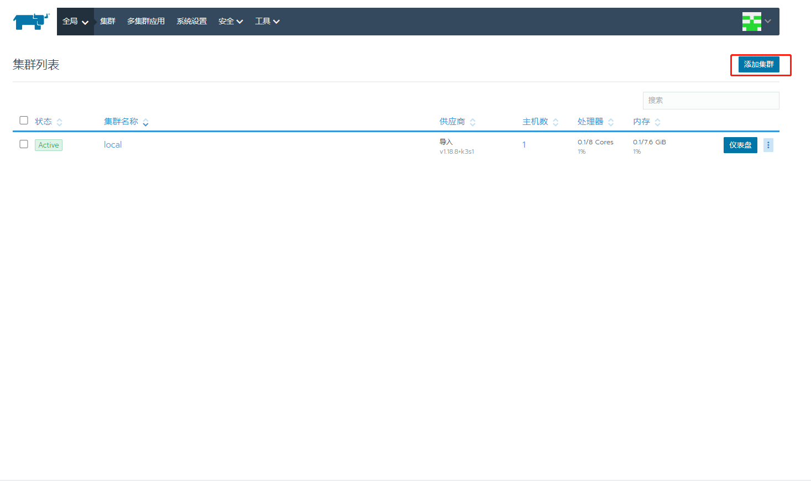
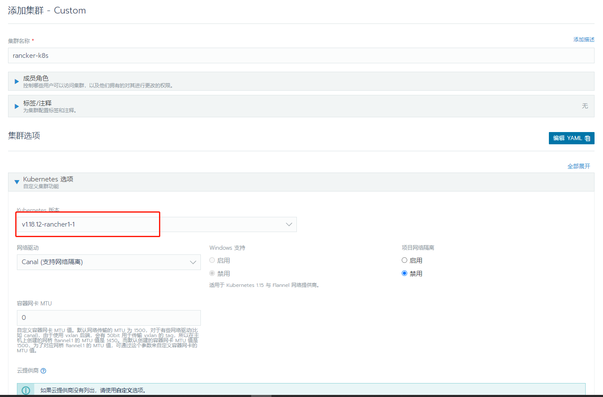
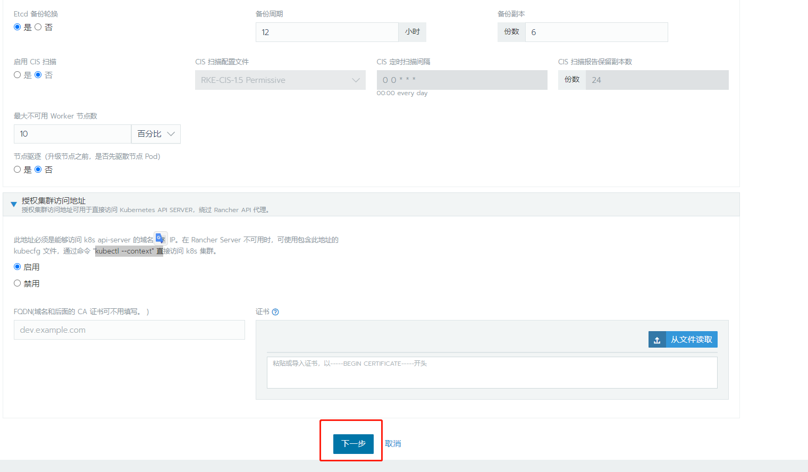
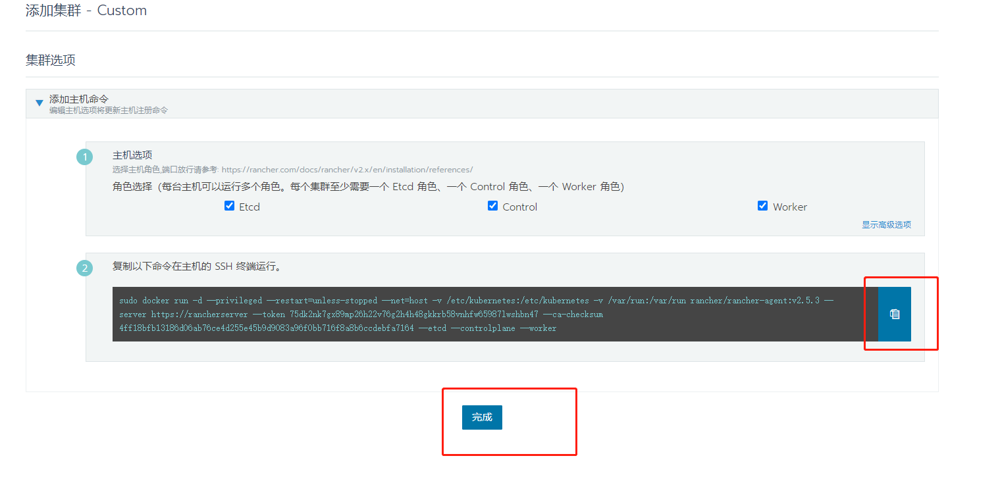
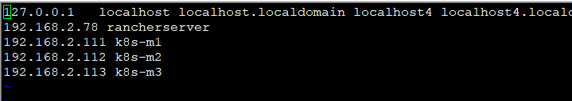
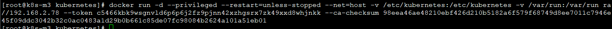

# rancher使用

## 1.清空老集群内容

## 1.1关闭老的rancher-agent

```bash
docker rm -f  mystifying_heyrovsky
docker rm -f  kube-apiserver
docker rm -f  etcd
docker rm -f  kubelet
docker rm -f  kube-scheduler
docker rm -f  kube-controller-manager 
```

### 1.2不推荐用

```bash
docker ps -aq
docker stop $(docker ps -aq)
docker rm  $(docker ps -aq)
docker rm  -f  $(docker ps -aq)  ##强制删
```

###1.3清空etcd

```
rm -rf /var/lib/etcd
rm -rf /etc/kubernetes
```
# 2安装rancher-service

```bash
docker run -d --restart=unless-stopped \
    -p 80:80 -p 443:443 \
     --privileged \
    rancher/rancher:stable
```


## 3.配置管理


### 1.设置密码

### 2.选择管理多集群

### 3.设置Rancher Server URL



## 5.创建集群


1.添加集群



2.配置集群信息




3.修改docker存储位置





4.复制添加主机命令



5.配置hosts

```bash
vi /etc/hosts
```




6.主机执行命




